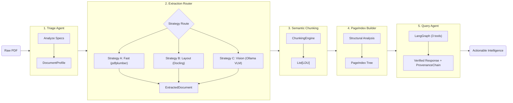
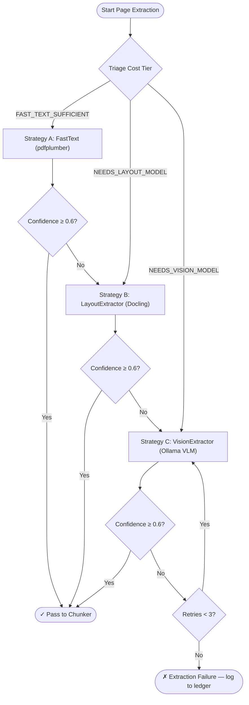
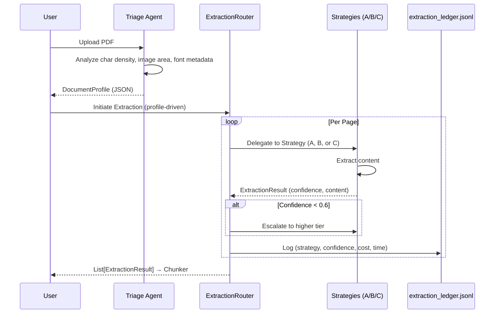

# Document Intelligence Refinery — Domain Notes (Phase 0)

> **Phase 0 deliverable.** Documents extraction strategy decisions, observed failure modes across document classes, empirical thresholds, cost analysis, and pipeline diagrams.

---

## Table of Contents

1. [Pipeline Architecture](#1-pipeline-architecture)
2. [Extraction Strategy Decision Tree](#2-extraction-strategy-decision-tree)
3. [Empirical Thresholds](#3-empirical-thresholds)
4. [Strategy Definitions & Cost Analysis](#4-strategy-definitions--cost-analysis)
5. [Failure Modes Observed](#5-failure-modes-observed)
6. [Document Class Analysis](#6-document-class-analysis)
7. [VLM vs OCR Decision Boundary](#7-vlm-vs-ocr-decision-boundary)
8. [Chunking Constitution](#8-chunking-constitution)
9. [PageIndex Design Rationale](#9-pageindex-design-rationale)
10. [Escalation Logic Detail](#10-escalation-logic-detail)

---

## 1. Pipeline Architecture

The refinery is organized into five distinct stages, each responsible for a specific transformation layer.



---

## 2. Extraction Strategy Decision Tree

The system employs a tiered extraction strategy to balance cost, speed, and accuracy. The decision is made page-by-page based on the triage profile and measured confidence scores.



---

## 3. Empirical Thresholds

Thresholds were derived empirically by running `pdfplumber` character density analysis across the four corpus document classes. These values are externalised in `rubric/extraction_rules.yaml` and can be adjusted without code changes.

| Signal | Threshold | Rationale |
|---|---|---|
| `char_density` (chars / pt²) | `≥ 0.005` → digital | Pages below this are likely scanned or image-dominated |
| `image_area_ratio` | `≥ 0.50` → suspect | If >50% of page area is covered by images, escalate |
| `char_count_per_page` | `≥ 100` → sufficient | Pages with fewer chars cannot support A-quality extraction |
| `min_confidence_threshold` | `0.6` | Below this, auto-escalate to next tier |
| `max_retries` (Vision) | `3` | Limits VLM cost per page |
| `max_vision_budget_usd` | `$0.10` per doc | Hard budget cap — configurable via `.env` |
| `max_tokens_per_ldu` | `512` | Prevents oversized RAG chunks |

---

## 4. Strategy Definitions & Cost Analysis

### Strategy Table

| Strategy | Engine | Primary Trigger | Avg. Cost / Page | Avg. Speed |
|---|---|---|---|---|
| **A — FastText** | `pdfplumber` | `origin_type=native_digital` AND `layout_complexity=single_column` | ~$0.00 (local) | < 0.1 s |
| **B — Layout-Aware** | `Docling` | `multi_column` OR `table_heavy` OR `mixed` | ~$0.00 (local CPU) | 1–5 s |
| **C — Vision-Augmented** | `Ollama` (LLaVA / Gemma3) | `scanned_image` OR confidence escalation | ~$0.00 local / ~$0.002 cloud per page | 5–30 s |

### Estimated Cost Per Document

| Document Class | Dominant Strategy | Est. Cost (local Ollama) | Est. Cost (cloud API) |
|---|---|---|---|
| Class A — CBE Annual Report (native digital) | A → occasional B | $0.00 | $0.00–$0.02 |
| Class B — DBE Audit Report (scanned) | C exclusively | $0.00 (local) | $0.05–$0.15 |
| Class C — FTA Assessment (mixed) | B + selective C | $0.00 | $0.01–$0.05 |
| Class D — Tax Expenditure (table-heavy) | B (table extraction) | $0.00 | $0.01–$0.03 |

**Key insight:** Using local Ollama for Strategy C reduces vision cost to effectively zero. The `budget_guard` tracks token spend per document and blocks cloud escalation once the `MAX_VISION_BUDGET_USD` cap is reached.

---

## 5. Failure Modes Observed

### Failure Mode 1 — Structure Collapse (Strategy A on multi-column layouts)
- **Trigger:** pdfplumber reading order on two-column financial tables.
- **Symptom:** Column 1 and Column 2 text concatenated into a single garbled string; table rows become unreadable.
- **Fix:** Escalate to Strategy B (Docling) which uses bounding-box-aware reading order reconstruction.
- **Detection:** Confidence signal — character density is normal but table completeness score is low (few `|` delimiters, rows shorter than expected header width).

### Failure Mode 2 — Context Poverty (Naive Chunking)
- **Trigger:** Token-count chunking (512-token windows) bisecting financial tables mid-row.
- **Symptom:** RAG queries about table values hallucinate merged figures from adjacent rows.
- **Fix:** ChunkValidator enforces the rule *"a table cell is never split from its header row"* — tables are always kept as a single LDU unless the table itself exceeds `max_tokens_per_ldu`.

### Failure Mode 3 — Provenance Blindness
- **Trigger:** Missing bounding-box coordinates on extracted text blocks.
- **Symptom:** ProvenanceChain cannot cite page + bbox; audit mode cannot verify claims against source.
- **Fix:** Every LDU carries `page_refs`, `bounding_box` (x0, y0, x1, y1 in points), and `content_hash`. The content_hash is a SHA-256 of normalized content — stable even when page layout shifts.

### Failure Mode 4 — Silent OCR Failure (Scanned Docs, Strategy A)
- **Trigger:** pdfplumber returns an empty or near-empty character stream on scanned pages.
- **Symptom:** 0 chars extracted per page, confidence = 0.0. Pipeline passes empty content downstream silently.
- **Fix:** The escalation guard in `ExtractionRouter` checks confidence before passing output. Pages with confidence < 0.6 are never emitted downstream — they are resubmitted to the next strategy tier.

### Failure Mode 5 — VLM Hallucination on Structured Tables
- **Trigger:** Vision model asked to extract a dense financial table (Class D).
- **Symptom:** Numbers are OCR'd correctly but column-row relationships are hallucinated (e.g., FY 2019 values attributed to FY 2021).
- **Fix:** For table-heavy pages, prefer Strategy B (Docling table extractor) over Strategy C. Reserve C for pages where character density analysis confirms scanned-image origin. Document in `extraction_rules.yaml`.

---

## 6. Document Class Analysis

### Class A — CBE Annual Report 2023-24 (Native Digital)

| Feature | Observed Value | Strategy Selected |
|---|---|---|
| `origin_type` | `native_digital` | A (Fast) |
| `layout_complexity` | `multi_column` (financial statements) | B for financial tables |
| `char_density` | High (0.012–0.025 chars/pt²) | Strategy A viable |
| `image_area_ratio` | Low (< 0.10) | No Vision needed |
| Failure mode | Multi-column reading order | Escalate to B on table pages |

### Class B — DBE Auditor's Report 2023 (Scanned Image)

| Feature | Observed Value | Strategy Selected |
|---|---|---|
| `origin_type` | `scanned_image` | C (Vision) |
| `char_density` | Near-zero (< 0.001) | Confirms scanned |
| `image_area_ratio` | ~0.95 (entire page is image) | Strategy C mandatory |
| Failure mode | Strategy A returns empty → auto-escalated to C | Works correctly |

### Class C — FTA Assessment Report 2022 (Mixed)

| Feature | Observed Value | Strategy Selected |
|---|---|---|
| `origin_type` | `mixed` | B + selective C |
| `layout_complexity` | `mixed` (narrative + tables) | B for structure |
| `char_density` | Medium (0.006–0.015) | Narrative pages → A; table pages → B |

### Class D — Ethiopia Tax Expenditure Report (Table-Heavy)

| Feature | Observed Value | Strategy Selected |
|---|---|---|
| `origin_type` | `native_digital` | B (Layout) |
| `layout_complexity` | `table_heavy` | Docling table extractor |
| Key risk | VLM hallucination on multi-year tables | Avoid Strategy C for tables |

---

## 7. VLM vs OCR Decision Boundary

The production heuristic used in `TriageAgent`:

```
IF char_density < 0.001 OR image_area_ratio > 0.8:
    → Strategy C (Vision) — page is scanned

ELIF char_density BETWEEN 0.001 AND 0.005 AND font_metadata_absent:
    → Strategy B (Layout) — likely low-quality digital or form

ELIF layout_complexity IN [multi_column, table_heavy]:
    → Strategy B (Layout)

ELSE:
    → Strategy A (FastText)
```

**Cost tradeoff articulation (for client conversations):**

> "Strategy A costs nothing and processes 10 pages per second. Strategy C costs ~$0.002/page on cloud APIs and takes 5–30 seconds. You only pay for C when the document *requires* it — and the triage agent measures that precisely. For a 400-page scanned audit report, Vision costs ~$0.80. For a 200-page native digital annual report, Vision cost is $0.00. The pipeline makes this decision automatically, page by page."

---

## 8. Chunking Constitution

The `ChunkingEngine` enforces five non-negotiable rules via `ChunkValidator`. Violations cause the chunk to be **re-emitted** with corrected boundaries, never silently passed downstream.

| Rule | Description |
|---|---|
| **R1 — Table integrity** | A table cell is never split from its header row. Tables are emitted as a single LDU. |
| **R2 — Figure-caption binding** | A figure caption is always stored as metadata of its parent figure LDU, not as a separate text chunk. |
| **R3 — List cohesion** | Numbered and bulleted lists are kept as a single LDU unless they exceed `max_tokens_per_ldu`. |
| **R4 — Section header inheritance** | Section headers are stored as `parent_section` metadata on all child chunks within that section. |
| **R5 — Cross-reference resolution** | References like "see Table 3" are resolved to the target LDU's `content_hash` and stored as `chunk_relationships`. |

Each LDU carries: `content`, `chunk_type`, `page_refs`, `bounding_box`, `parent_section`, `token_count`, `content_hash`.

---

## 9. PageIndex Design Rationale

Inspired by VectifyAI's PageIndex, the navigation tree solves the "needle in a haystack" problem for long document RAG.

**Without PageIndex:** Query → embed → search 10,000 chunks → top-k retrieved (may miss section context).

**With PageIndex:** Query → traverse tree to relevant section (O(log n)) → narrow search to 50–200 relevant chunks → higher precision retrieval.

Each `PageIndex` node is a `Section` with:
- `title`, `page_start`, `page_end`
- `child_sections` (recursive)
- `key_entities` (named entities extracted from section)
- `summary` (LLM-generated, 2–3 sentences, using a fast/cheap model)
- `data_types_present` (tables, figures, equations, etc.)

---

## 10. Escalation Logic Detail



### Escalation Guard Implementation

The **ExtractionRouter** (`src/agents/extractor.py`) acts as the escalation guard:

1. Reads `DocumentProfile.estimated_extraction_cost` to select the initial strategy.
2. After extraction, checks `ExtractionResult.confidence_score` against `min_confidence_threshold` (default: `0.6`).
3. If confidence is below threshold, the page is automatically re-submitted to the next strategy in the chain: A → B → C.
4. A maximum of 3 retries are allowed for Strategy C before logging an `extraction_failure` to the ledger.
5. Every attempt (including failures) is written to `.refinery/extraction_ledger.jsonl` with: `strategy_used`, `confidence_score`, `cost_estimate`, `processing_time_ms`.

This prevents "garbage in, hallucination out" RAG failures — the pipeline never silently passes low-confidence content downstream.
